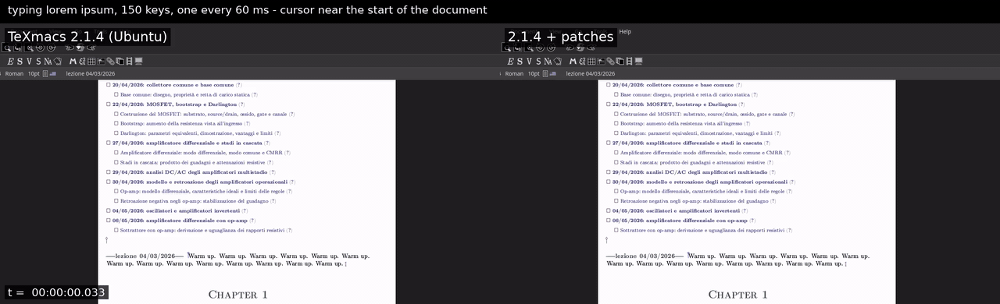
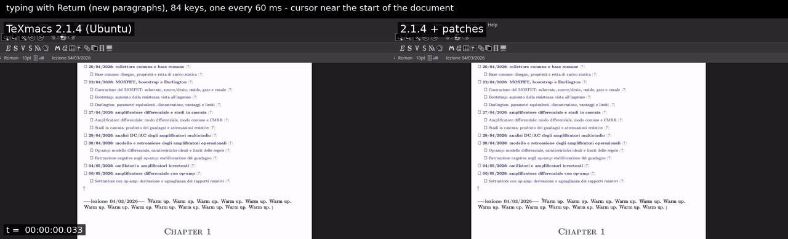
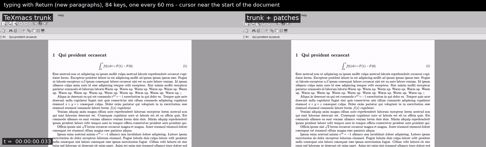
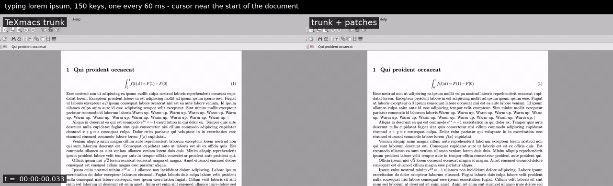

# Faster typing in long GNU TeXmacs documents

Evidence and material for a patch series that makes typing in long TeXmacs documents
2–4× cheaper (continuous page mode).

* Pull request: https://github.com/texmacs/texmacs/pull/112
* Savannah patch: https://savannah.gnu.org/patch/?10633 (same series, one file)
* Full technical report: [REPORT.md](REPORT.md)
* The patches: [patches/](patches/) (against the `development` branch; they also apply to
  current trunk)

## Before / after

Each video shows the unpatched build on the left and the patched build on the right. The
same key is sent to both at the same moment, one every 60 ms. Watch the right-hand corner
tags: when "last key sent" appears, the unpatched side is still catching up.

**Lecture notes, 3,500 paragraphs with figures, typing near the start** (TeXmacs 2.1.4 vs 2.1.4 + series)

**Same notes, typing text with Return**

**Synthetic document, 3,500 paragraphs with figures and footnotes, typing with Return** (trunk vs trunk + series)

**Synthetic document, 2,000 paragraphs, typing near the start**

(The previews are 8 fps GIFs; click one for the full video.)

| video | unpatched | patched (CPU per key) |
|---|---|---|
| [notes-B-top-lorem](videos/notes-B-top-lorem.mp4): lecture notes, 3,500 paragraphs with figures, cursor near the start | 80.5 ms | 47.3 ms |
| [notes-B-top-enter](videos/notes-B-top-enter.mp4): same notes, typing with Return | 98.5 ms | 49.2 ms |
| [notes-A-top-lorem](videos/notes-A-top-lorem.mp4): lecture notes, 2,100 paragraphs | 58.6 ms | 30.9 ms |
| [synth-2000-top-lorem](videos/synth-2000-top-lorem.mp4): synthetic, 2,000 paragraphs | 57.4 ms | 24.7 ms |
| [synth-2000-end-lorem](videos/synth-2000-end-lorem.mp4): same, cursor at the end | 56.0 ms | 22.1 ms |
| [synth-3500f-top-lorem](videos/synth-3500f-top-lorem.mp4): synthetic, 3,500 paragraphs with figures and footnotes | 61.7 ms | 30.9 ms |
| [synth-3500f-top-enter](videos/synth-3500f-top-enter.mp4): same, typing with Return | 83.3 ms | 36.2 ms |

The lecture-notes videos compare the Debian/Ubuntu package of TeXmacs 2.1.4 with the same
package plus the series; the synthetic ones compare upstream trunk with trunk plus the
series. Raw numbers: [videos/measurements.txt](videos/measurements.txt). In paper
(paginated) page mode the series does not change the speed (63.0 vs 62.4 ms per key).

## Reproducing

* `synth/`: the synthetic documents (lorem ipsum), generated by
  [`bench/gen-synth.py`](bench/gen-synth.py).
* [`bench/video.py`](bench/video.py): runs two builds side by side on private X servers
  (Xvfb), sends the same keys to both with XTest, records both screens and measures the CPU
  time per key.
* [`bench/verify-pixels.py`](bench/verify-pixels.py) with [`bench/verify.scm`](bench/verify.scm):
  applies a fixed sequence of edits in both builds, then pages through the document and
  compares full-screen screenshots, which must be identical.
* `bench/fakebin/mktexpk`: a failing stand-in, so that missing fonts do not start real
  font generation during measurements.

The scripts were written for one machine and expect the paths used there (see the top of
each script); they are published as a record of how the measurements were made.

---

This work was done with the help of Claude Opus 5.5.
